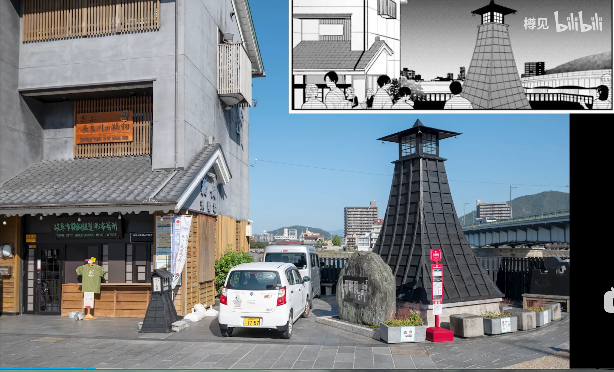
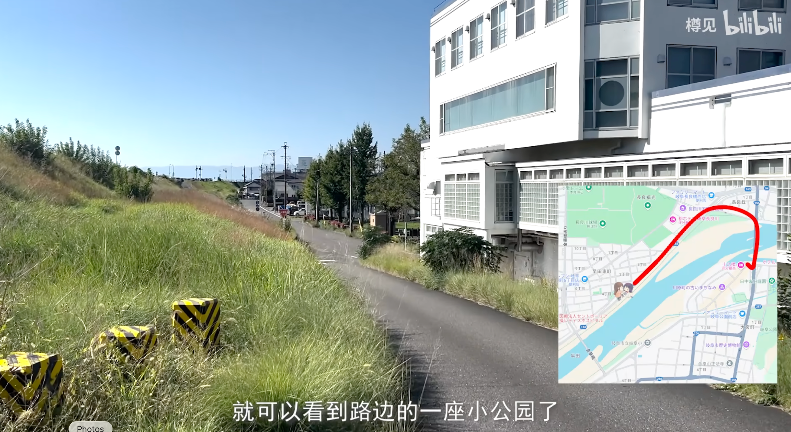
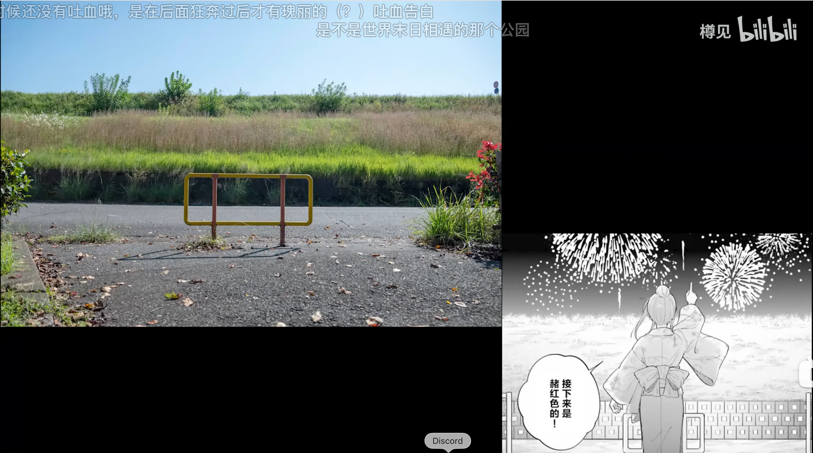
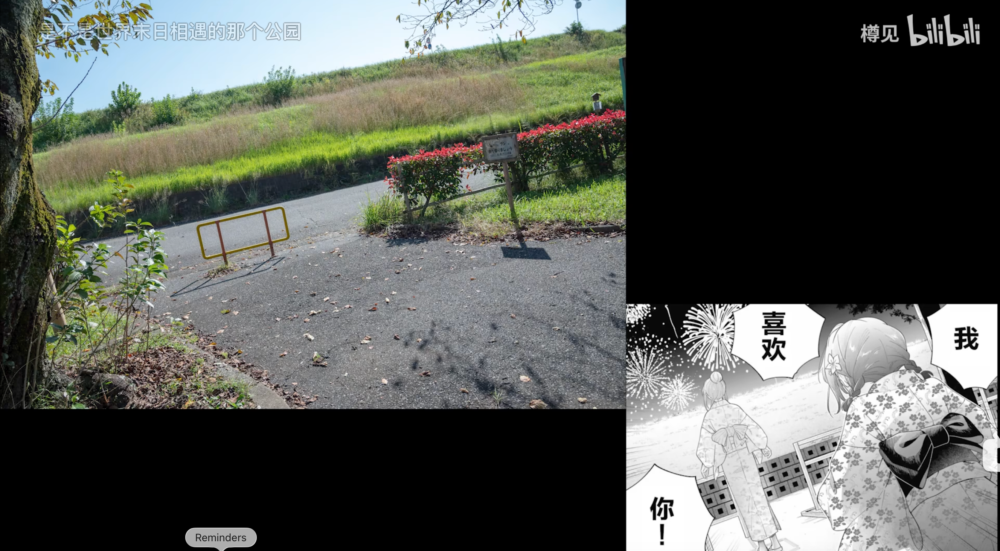
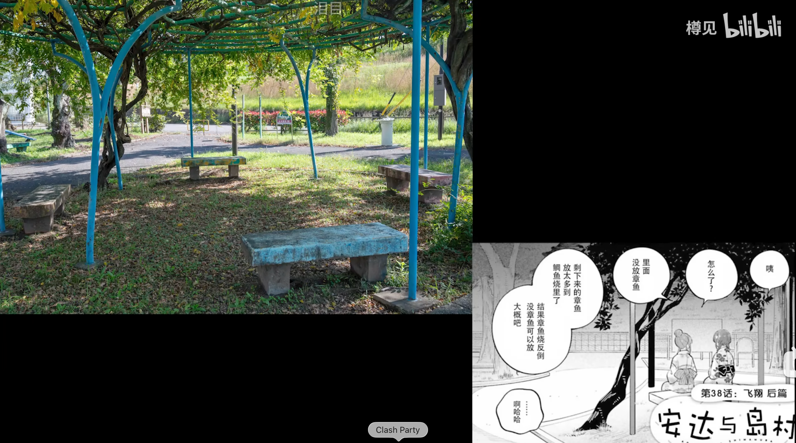
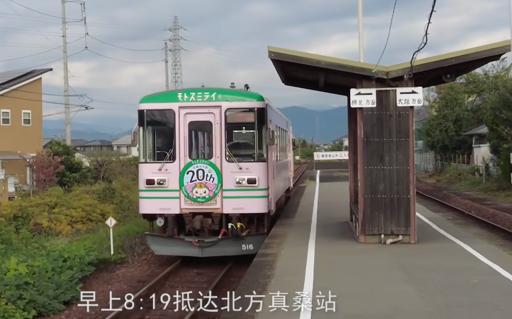
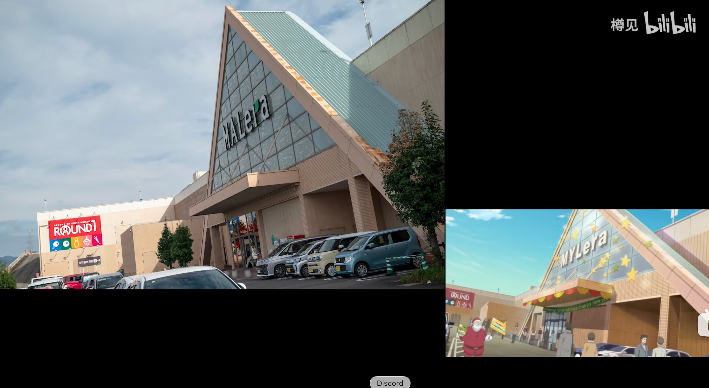
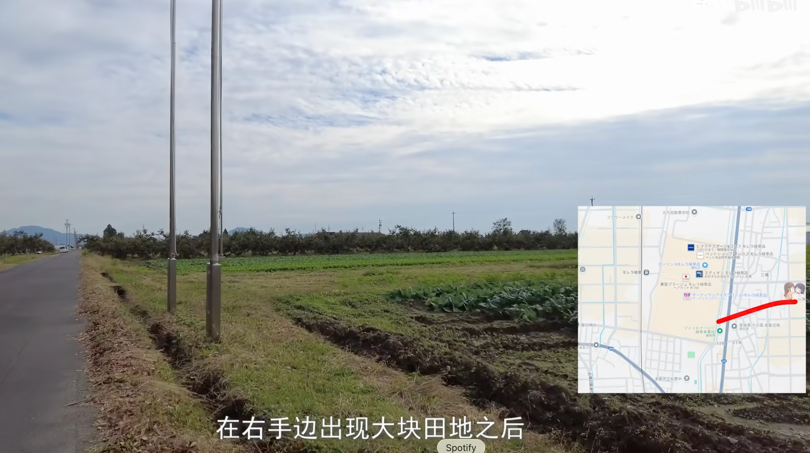

# 岐阜圣地巡礼路线
## 1. 岐阜站
[岐阜站](https://www.google.com/maps/place/Gifu+Station/@35.4093682,136.7296996,13.57z/data=!4m10!1m3!11m2!2szNGRvTpLI5je6K2ycpx_rA!3e3!3m5!1s0x6003a93773be07c3:0x18c44a3f47fec311!8m2!3d35.4095278!4d136.7564656!16s%2Fm%2F02r4jvg?entry=ttu&g_ep=EgoyMDI2MDkwOS4wIKXMDSoASAFQAw%3D%3D)

[圣地巡礼视频](https://www.bilibili.com/video/BV1epzrY2Ezv)

- 莫斯汉堡(第一次牵手的地方)
- 
- 甜甜圈

## 2. 長良川-花火大会

### 2.1 花火见面的地方

### 2.2 告白路线和地点（早田）
告白路线和地点

### 2.3 安达与岛村的高中

